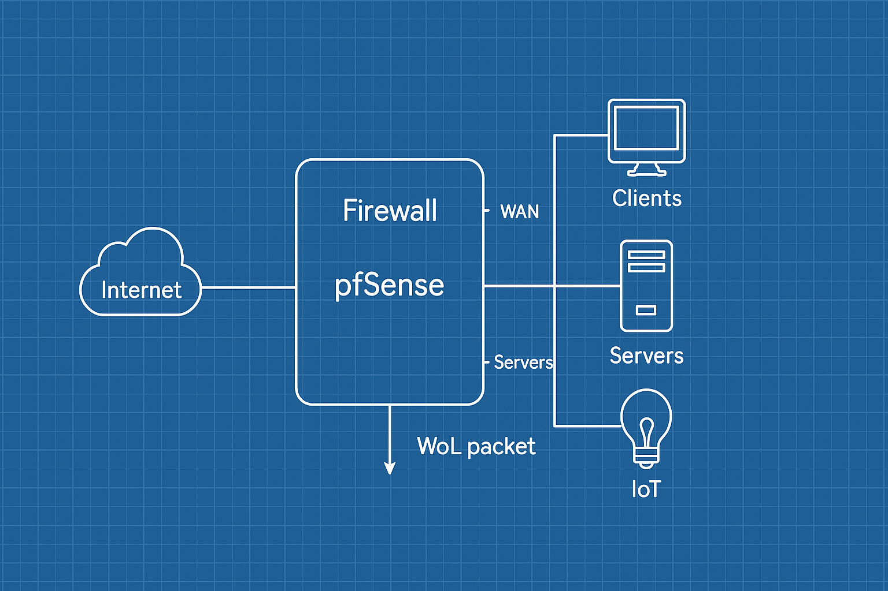

# 🌐 pfSense Wake-on-LAN Listener (WoL Trigger Script)

This script listens for **Wake-on-LAN** packets on the **WAN interface** of a pfSense firewall and automatically runs a set of custom `wol` commands to wake multiple devices on the network.

---

### 👤 Author
**Yaswanth Surya Chalamalasetty**

---

## 🖼️ Network Topology



This blueprint-style diagram shows where the pfSense firewall fits in and how it wakes various devices when a WoL packet is detected.

---

## ⚙️ How It Works

1. `tcpdump` continuously listens for WoL packets (`UDP port 9`) on the WAN interface.
2. Upon detecting a WoL packet:
   - It logs the packet info to `/root/received.txt`
   - Executes a series of `wol` commands to wake specific systems
   - Logs results to `/root/command_status.log`

---

## 📥 Setup Instructions

### 1️⃣ Install Required Packages

Make sure `tcpdump` and `wol` are available on your pfSense shell:

```bash
pkg install wol tcpdump

### 2️⃣ Upload the Script
